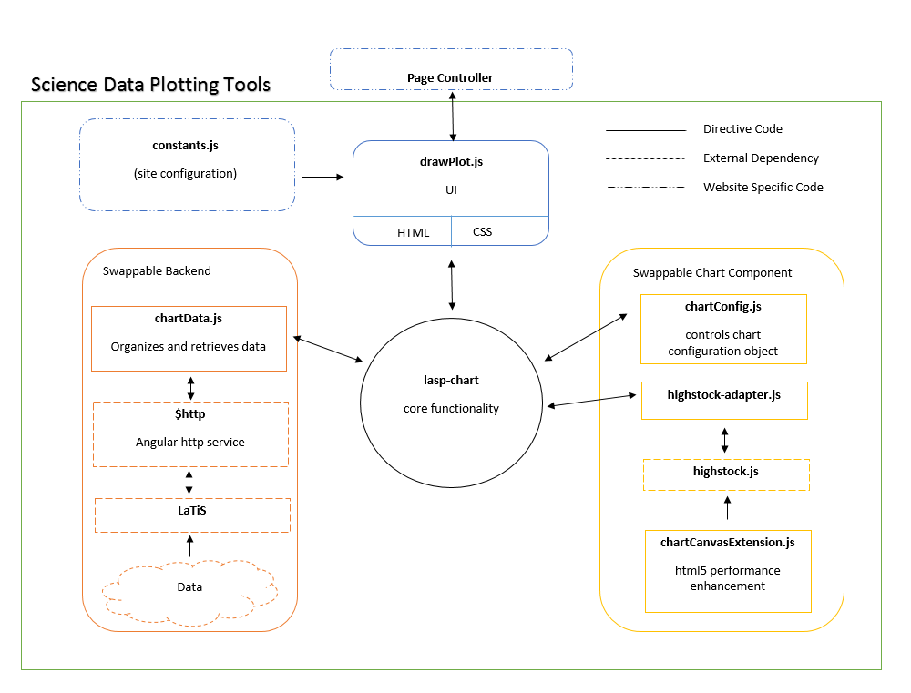

# LASP Highstock

### LASP Highstock Summary

This is the angularJS-style directive that the web application development team uses to implement
the highstock plugin. It is designed to assist users with exploring scientific data in many
different formats

#### Usage

```
<div draw-plot plot-list="plots" chart="plot.chart" local-options="plot.localOptions" func="plot.func" plot-obj="plot.plotObj"></div>
```
- plot-list: reference to full plot list. This allows the directive to remove itself from a list
- chart: A reference to the object created by highstock. This allows the main controller to set
global functions and variables if it needs to.
- local-options: The configuration for the plot.
- func: Optional function that is passed to highstock
- plot-obj: references the local scope created by the directive

### Architecture

#### Files

- lasp-chart.js: Main directive. Determines the behavior when an option is changed or new data is
	received.
- drawPlot.js: Wraps our lasp-chart directive with functions that allow options to be changed
	locally. This directive also creates a local scope to isolate our chart from the main scope.
- chartData.js: This service stores and retrieves our data. Right now it is configured to talk to a
	latis backend, but other backends could easily be swapped in.
- chartConfig.js: This service stores and modifies our chart configuration object. This code is
	specific to highstock.
- highstock-adapter.js: This adapter abstracts out the highstock functions. If we want to change our
	charting tool all we need to do is write another apapter and chartConfig service specific to
	that tool.
- chartCanvasExtension.js: This is a performance enhancement specific to highstock heatmaps. This
	code is only used in lisird3 for plotting spectrograms.

#### Flowchart



### Build System

We use a standard [Gulp](https://gulpjs.com/) and [Node](https://nodejs.org/en/) build system for this project.

##### Task Cheatsheet

* Top-level tasks:
	* `build`
	* `clean`
	* `cleanBuild`
	* `serve`
    * `serve:dist`
    * `watchCopy -p [project-name]` or  
    `watchCopy --project [project-name]`
* Deployment-related tasks (also top-level)
	* `deployDemo`

### Running LASP Highstock Locally

##### Project Dependencies

You'll need to have [NodeJS v5](https://nodejs.org/en/) (or greater) and [Gulp](http://gulpjs.com/)
installed locally (globally, or however you like to run them).

Run `gulp serve` to test your changes.

##### Developing lasp-highstock in the context of another project

You can easily test changes to lasp-highstock in the context of another project if you have the other project's repo cloned to into a sister directory to lasp-highstock.

Run `gulp watchCopy -p [project-name]` in your lasp-highstock directory, where `[project-name]` is the name of the project that has lasp-highstock as a bower dependency. The project's bower components folder must be `[project-dir]/app/bower_components`. This command will build the dist files and copy them to the other project any time you make changes to lasp-highstock source files.

### Deploying LASP Highstock

##### Process

###### Publish changes to LASP Highstock

1. Make your changes (e.g. in a feature branch)
2. Run `gulp build` to make sure the `dist` folder has the latest built files.
3. Commit the `dist` folder
4. Merge to `master`
    * If you run into merge conflicts in the `dist` folder, the correct thing to do is to run
    `gulp build` again and commit the newly re-built files. If there are merge conflicts in any
    other folder, you must resolve them manually before you re-run `gulp build`.
    * It doesn't hurt to run `gulp build` again on the master branch after the merge. Theoretically
    it shouldn't produce any changes, but if it does just commit them directly to master.

###### Import LASP Highstock into dependent project (first time)

1. Get the git commit hash of the latest commit on master
    * e.g. `git checkout master && git pull && git rev-parse HEAD`
2. Install [bower](https://bower.io/) if necessary
3. If you don't have a `bower.json` file, run `bower init`
4. Run `bower install --save git+https://github.com/lasp/lasp-highstock.git`
    * Replace the git hash with whatever hash you saw in step #1
5. Commit the results; both the new folders in `bower_components` and the changes to `bower.json`.

###### Update LASP Highstock in a project that's already installed it

1. Get the git commit hash of the latest commit on master
    * e.g. `git checkout master && git pull && git rev-parse HEAD`
2. Update the lasp-highstock's git hash in `bower.json`
3. Run `bower update lasp-highstock`
4. Commit the results

### External Resources

[Highstock API](http://api.highcharts.com/highstock)

#### Copyright
Copyright 2018 Regents of the University of Colorado. All rights reserved.

#### Terms of Use
Commercial use of this project is forbidden due to the terms set forth by Highstock.
